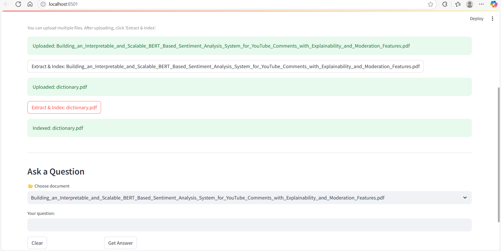

# SkyVision AI – Intelligent Document Q&A System

SkyVision AI is a real-world Retrieval-Augmented Generation (RAG) system that enables intelligent question-answering over any uploaded PDF or CSV document. Built with LangChain, OpenAI embeddings, FAISS, and Streamlit, it supports scalable deployment via Docker and Google Cloud Platform (GCP). Ideal for resumes, reports, research papers, and large structured data files.

---

## Key Features

-  Upload and analyze documents up to 100MB (PDF or CSV)
-  Semantic chunking using LangChain (500 token windows, 100 overlap)
-  Embeddings powered by OpenAI's `text-embedding-ada-002`
-  Ultra-fast search with FAISS (~100ms retrieval time)
-  Answers generated using `gpt-3.5-turbo` in under 3 seconds
-  Modular pipeline for easy model/embedding upgrades
-  Dockerized and deployed to GCP Cloud Run with auto-scaling
-  Secure secret handling via `.env` or GCP Secret Manager

---

## Project Structure

`skyvision_ai/`

  - `app.py`                      # Streamlit frontend (UI)
  - `utils.py`                    # Core logic (indexing, retrieval)
  - `embed_store.py`              # Script for static text FAISS indexing

 - `data/`
   - `input/`                  # Uploaded PDFs/CSVs
   - `extracted/`              # Extracted raw text
   - `skyvision_faiss_index/` # Stored FAISS indexes

- `.env`                       # OpenAI key for local dev
- `.streamlit/secrets.toml`    # Secrets for Streamlit Cloud (optional)
- `requirements.txt`           # Python dependencies
- `Dockerfile`                # Container setup for GCP deployment
- `README.md`                 # Project documentation

---
## Screenshots

| Uploading & Indexing                        | Q&A in Action                          |
|--------------------------------------------|----------------------------------------|
|  |         |
|  |                                        |

---

##  System Architecture

> End-to-end document Q&A pipeline using Retrieval-Augmented Generation (RAG)

User Upload (PDF/CSV)
↓
Text Extraction (PyPDF2 / pandas)
↓
Chunking (LangChain TextSplitter)
↓
Embedding (OpenAIEmbeddings)
↓
Vector Store (FAISS)
↓
User Query
↓
Top-k Retrieval (FAISS)
↓
LLM Answering (GPT-3.5 Turbo)
↓
Answer + Source Chunks Returned

##  Real-World Applications

- HR teams extracting summaries from resumes
- Legal professionals querying lengthy contracts
- Research analysts searching key facts in academic papers
- Enterprise users handling operational PDFs and logs
- 
## Local Development Setup

Follow these steps to set up and run the application locally:

### 1. Clone the Repository

git clone https://github.com/vengotimuktha/skyvision_ai_final.git
cd skyvision_ai

### 2. Set Up Virtual Environment

python -m venv venv
venv\Scripts\activate        # On Windows
source venv/bin/activate  # On Mac/Linux

### 3. Install Dependencies
pip install -r requirements.txt

### 4. Add Your OpenAI API Key

Create a .env file in the root directory:
OPENAI_API_KEY=your-openai-key-here

Alternatively, use .streamlit/secrets.toml:
[general]
OPENAI_API_KEY = "your-openai-key-here"

### 5. Run the Application

streamlit run app.py

### GCP Cloud Deployment 
SkyVision AI is fully Dockerized and deployed on Google Cloud Run.

GCP Secret Manager for API key management

Auto-scaling containerized service

Endpoint exposed via HTTPS with Cloud Run URL

99.9% uptime and low-latency answers

## Future Enhancements
Add file-level memory and persistent session chat

Support for DOCX, XLSX, JSON ingestion

Replace OpenAI with local models (e.g., Ollama, Llama 3)

Add user login + usage tracking

## Author

**Mukthasree Vengoti**  
GenAI Engineer |  Reality AI Lab  
 Portfolio: [https://datascienceportfol.io/mukthasreevengoti](https://datascienceportfol.io/mukthasreevengoti)  
 LinkedIn: [https://www.linkedin.com/in/mukthasree-vengoti](https://www.linkedin.com/in/mukthasree-vengoti)

---

##  Next Steps

1.  Place your screenshots:
   - `upload_example.png`
   - `qa_example.png`
   - `rag_architecture.png`
   inside a `screenshots/` folder in your repo.

2.  Paste this full README.md into your GitHub.

3.  Commit and push.

Let me know if you want help **creating the architecture diagram** or polishing **live demo setup instructions** next.

